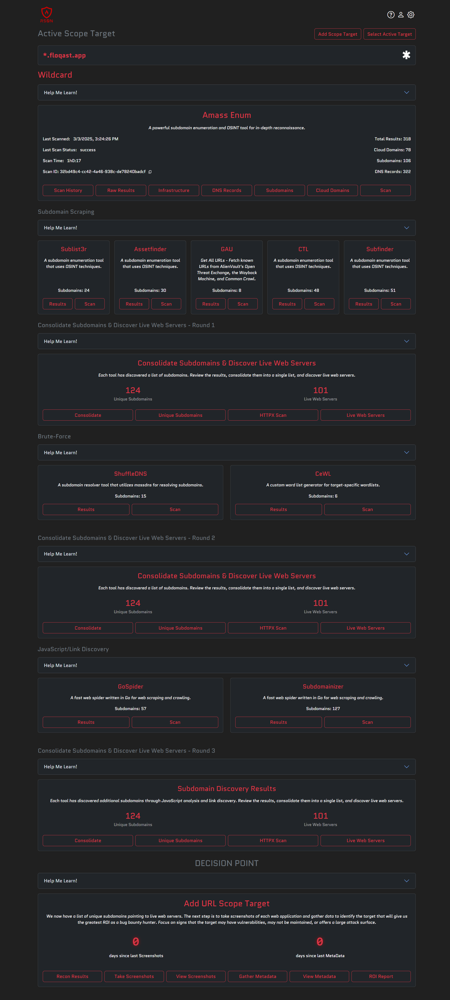
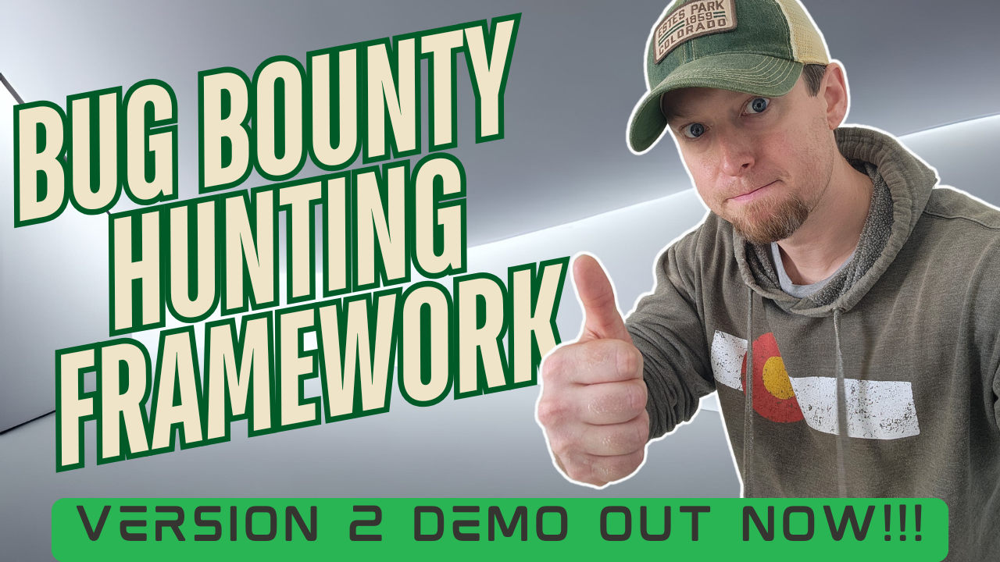
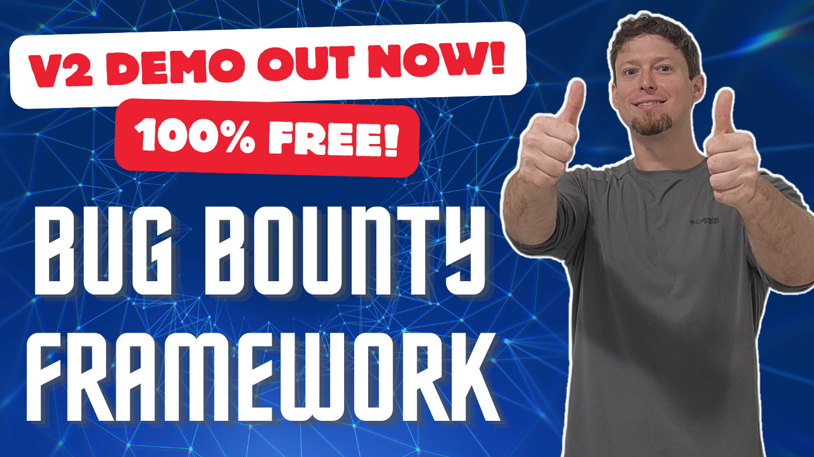

<h1 align="center">
Ars0n Framework v2
</h1>

<p align="center">
  <a href="#about">About</a> •
  <a href="#download-and-install">Download & Install</a> •
  <a href="#getting-started">Getting Started</a> •
  <a href="#workflows">Workflows</a> •
  <a href="#troubleshooting">Troubleshooting</a> •
  <a href="#frequently-asked-questions">FAQs</a> •
  <a href="https://www.youtube.com/@rs0n_live" target=”_blank”>YouTube</a> •
  <a href="https://www.linkedin.com/in/harrison-richardson-rs0n-7a55bb158/" target=”_blank”>LinkedIn</a>
</p>

<p align="center">
    <em>🚨 Pre-Alpha Release Out now!!  Beta Launch @ DEFCON 33 Bug Bounty Hunting Village!!! 🚨</em>
</p>

<p align="center">My full bug bounty hunting methodology built into a single framework!  Automate the most common bug bounty hunting workflows and <em>Earn While You Learn</em>!</p>

<div align="center">
  <a href="https://www.youtube.com/watch?v=Kw1tPiVxBTg">
    
  </a>
</div><br>

<p align="center">The goal of this tool is to eliminate the barrier of entry for bug bounty hunting.  My hope is that someone can pick up this tool and start hunting on day one of their AppSec journey 🚀</p>

<h4 align="center">
🤠 Did you know that over 95% of scientists believe there is a direct correlation between the amount of coffee I drink and how quickly I can build new features?  Crazy, right?!  Well, now you can test their hypothesis and Buy Me a Coffee through this fancy button!!  🤯
<br>
<br>
<a href="https://www.buymeacoffee.com/rs0n.evolv3" target="_blank"></a>
</h4>

## About

Howdy!  My name is Harrison Richardson, or `rs0n` (arson) when I want to feel cooler than I really am.  The code in this repository started as a small collection of scripts to help automate many of the common Bug Bounty hunting processes I found myself repeating.  Over time, I built these scripts into an open-source framework that helped thousands of people around the world begin their bug bounty hunting journey.  

However, the first implementation of the framework had a wide range of issues.  The majority of the problems were a result of the tool never being designed with the intent of being shared as an open-source project.  So I got to work on a version 2 that would solve these problems and bring my vision to life!



**The Ars0n Framework V2** is designed to be a tool that allows people to start REAL bug bounty hunting against actual targets on day one!  The framework acts as a wrapper around 20+ widely used bug bounty hunting tools and a clever UI design forces the user into a correct hunting methodology.  It is literally impossible to use this tool without going through rs0n's process!  

The results of each tool are stored in a central database and can be used for understanding/visualizing the target company's attack surface.  Each section also includes a "Help Me Learn!" dropdown that includes a lession plan to help the user understand what part of the methodology they are at, what they are trying to acheive, and most importantly the "Why?" behind it.

My hope is that this modular framework will act as a canvas to help share what I've learned over my career to the next generation of Security Engineers!  Trust me, we need all the help we can get!!

<p align="center"><b>Pre-Alpha Demo Videos</b></p>

<div align="center">
  <a href="https://www.youtube.com/watch?v=u-yPpd0UH8w">
    
  </a>&nbsp;&nbsp;&nbsp;&nbsp;&nbsp;&nbsp;&nbsp;&nbsp;&nbsp;&nbsp;
  <a href="https://www.youtube.com/watch?v=kAO0stO-hBg">
    
  </a>
</div><br>

<p align="center"><b>The Ars0n Framework v2 Includes All These Tools And More!</b></p>

<p align="center">
    <a href="https://github.com/owasp-amass/amass">Amass</a> - Advanced attack surface mapping and asset discovery tool for security research<br>
    <a href="https://github.com/projectdiscovery/subfinder">Subfinder</a> - Fast and reliable subdomain enumeration tool with multiple data sources<br>
    <a href="https://github.com/aboul3la/Sublist3r">Sublist3r</a> - Fast subdomain enumeration tool using various search engines and data sources<br>
    <a href="https://github.com/tomnomnom/assetfinder">Assetfinder</a> - Find assets related to a domain using various data sources and APIs<br>
    <a href="https://github.com/projectdiscovery/httpx">Httpx</a> - Fast and multi-purpose HTTP toolkit for web reconnaissance and scanning<br>
    <a href="https://github.com/jaeles-project/gospider">GoSpider</a> - Fast web spider written in Go for crawling and extracting URLs<br>
    <a href="https://github.com/nsonaniya2010/SubDomainizer">Subdomainizer</a> - Advanced subdomain enumeration tool with multiple discovery methods<br>
    <a href="https://github.com/digininja/CeWL">CeWL</a> - Custom word list generator that spiders websites to create targeted wordlists<br>
    <a href="https://github.com/projectdiscovery/shuffledns">ShuffleDNS</a> - Mass DNS resolver with wildcard filtering and validation capabilities<br>
    <a href="https://github.com/projectdiscovery/nuclei">Nuclei</a> - Fast and customizable vulnerability scanner with extensive template library<br>
    <a href="https://github.com/projectdiscovery/katana">Katana</a> - Fast and powerful web crawler for discovering hidden endpoints and content<br>
    <a href="https://github.com/ffuf/ffuf">FFuf</a> - Fast web fuzzer with support for multiple protocols and advanced filtering<br>
    <a href="https://github.com/lc/gau">GAU</a> - Get All URLs tool that fetches known URLs from various historical data sources<br>
    <a href="https://github.com/pdiscoveryio/ctl">CTL</a> - Certificate Transparency Log tool for discovering subdomains from SSL certificates<br>
    <a href="https://github.com/projectdiscovery/dnsx">DNSx</a> - Fast and multi-purpose DNS toolkit for running multiple DNS queries<br>
    <a href="https://github.com/initstring/cloud_enum">Cloud Enum</a> - Multi-cloud OSINT tool for enumerating public resources in AWS, Azure, and Google Cloud<br>
    <a href="https://github.com/j3ssie/metabigor">Metabigor</a> - OSINT tool for network intelligence gathering including ASN and IP range discovery<br>
    <a href="https://github.com/gwen001/github-search">GitHub Recon</a> - GitHub reconnaissance tool for discovering organization mentions and domain patterns<br>
    <a href="https://github.com/projectdiscovery/naabu">Naabu</a> - Fast port scanner for discovering open ports and services<br>
    <a href="https://github.com/whoxy/whoxy">Reverse Whois</a> - Reverse WHOIS lookup using Whoxy to find domains registered by the same entity<br>
    <a href="https://securitytrails.com">SecurityTrails</a> - Comprehensive DNS, domain, and IP data provider for digital asset discovery<br>
    <a href="https://censys.io">Censys</a> - Internet-wide scanning platform for discovering and monitoring assets<br>
    <a href="https://shodan.io">Shodan</a> - Search engine for internet-connected devices and services<br>
</p>

## Download And Install

This framework consists of 20+ Docker containers along w/ a Docker Compose Manifest to automate the process of deploying these containers.

1. Download the Zip File for the <a href="https://github.com/R-s0n/ars0n-framework-v2/releases/download/beta-0.0.1/ars0n-framework-v2-beta-0.0.1.zip">latest release</a>
2. Unzip the files
3. Navigate to the directory with the `docker-compose.yml` file
4. Run `docker-compose up --build`

*HINT: If you get a docker error, the problem is probably w/ docker, not my framework*

### Windows

**Step 1:** Download the framework
```powershell
Invoke-WebRequest -Uri "https://github.com/R-s0n/ars0n-framework-v2/releases/download/beta-0.0.1/ars0n-framework-v2-beta-0.0.1.zip" -OutFile "ars0n-framework-v2-beta-0.0.1.zip"
```

**Step 2:** Extract the zip file
```powershell
Expand-Archive -Path "ars0n-framework-v2-beta-0.0.1.zip" -DestinationPath "."
```

**Step 3:** Navigate to the framework directory
```powershell
cd ars0n-framework-v2
```

**Step 4:** Start the framework
```powershell
docker-compose up --build
```

### Mac

**Step 1:** Download the framework
```bash
curl -L -o ars0n-framework-v2-beta-0.0.1.zip "https://github.com/R-s0n/ars0n-framework-v2/releases/download/beta-0.0.1/ars0n-framework-v2-beta-0.0.1.zip"
```

**Step 2:** Extract the zip file
```bash
unzip ars0n-framework-v2-beta-0.0.1.zip
```

**Step 3:** Navigate to the framework directory
```bash
cd ars0n-framework-v2
```

**Step 4:** Start the framework
```bash
docker-compose up --build
```

### Linux

**Step 1:** Download the framework
```bash
wget "https://github.com/R-s0n/ars0n-framework-v2/releases/download/beta-0.0.1/ars0n-framework-v2-beta-0.0.1.zip"
```

**Step 2:** Extract the zip file
```bash
unzip ars0n-framework-v2-beta-0.0.1.zip
```

**Step 3:** Navigate to the framework directory
```bash
cd ars0n-framework-v2
```

**Step 4:** Start the framework
```bash
docker-compose up --build
```

## Getting Started

Once you have the Ars0n Framework v2 running, you'll be presented with a welcome screen that offers several options to begin your bug bounty hunting journey. Here's how to get started:

### Option 1: Create a New Scope Target

**Best for:** Starting fresh reconnaissance on a new target

1. **Choose Target Type:**
   - **Company**: Any asset owned by an organization (e.g., "Google")
   - **Wildcard**: Any subdomain under the root domain (e.g., "*.google.com")
   - **URL**: Specific attack vector targeting a single domain (e.g., "https://hackme.google.com")

2. **Enter Target Information:**
   - For Company targets: Enter the company name
   - For Wildcard targets: Enter the wildcard domain pattern
   - For URL targets: Enter the specific URL

3. **Begin Reconnaissance:**
   - The framework will automatically start gathering intelligence about your target
   - You can then run individual tools or use the Auto Scan feature

### Option 2: Import Existing Scan Data

**Best for:** Learning from pre-scanned data or resuming previous sessions

#### Import from File:
1. Download a `.rs0n` file (like those available in the [scan data repository](https://github.com/R-s0n/ars0n-framework-v2-scan-data))
2. Click "Import Scan Data" in the welcome screen
3. Select "Upload File" and choose your `.rs0n` file
4. The framework will import all scope targets and associated scan results

#### Import from URL:
1. Click "Import Scan Data" in the welcome screen
2. Select "Import from URL"
3. Enter the raw GitHub URL of a `.rs0n` file:
   ```
   https://github.com/R-s0n/ars0n-framework-v2-scan-data/raw/refs/heads/main/Grammarly/rs0n-export-2025-07-27T18-19-17.rs0n
   ```
4. The framework will download and import the data automatically

### Option 3: Use Pre-Scanned Data for Learning

**Best for:** Understanding the bug bounty hunting process without running scans

The [Ars0n Framework v2 Scan Data Repository](https://github.com/R-s0n/ars0n-framework-v2-scan-data) contains real-world scan data that you can import to learn:

- **Subdomain Discovery**: How various tools find subdomains and assets
- **Vulnerability Assessment**: Common security issues and how they're identified
- **Attack Surface Mapping**: Understanding an organization's digital footprint
- **Reconnaissance Methodology**: The systematic approach to bug bounty hunting

## Workflows

The Ars0n Framework v2 supports three distinct workflows, each designed for different reconnaissance scenarios and objectives. Each workflow follows rs0n's proven bug bounty methodology and automatically guides users through the correct sequence of tools and techniques.

### Company Workflow

**Objective:** Discover and map all digital assets owned by an organization to build a comprehensive attack surface for security testing.

The Company workflow is designed to answer the question: "What does this organization's entire digital footprint look like?" This workflow takes a company name and systematically discovers all assets that organization owns or operates, both on-premises and in the cloud.

#### Key Steps:

1. **ASN (On-Prem) Network Ranges** - Discover network infrastructure owned by the organization
   - **Tools:** Amass Intel, Metabigor
   - **Purpose:** Intelligence gathering and ASN enumeration for comprehensive network range discovery
   - **How:** Uses company name to discover Autonomous System Numbers (ASNs) and associated IP network ranges through WHOIS data and BGP routing information

2. **Discover Live Web Servers (On-Prem)** - Find active web services in discovered network ranges
   - **Tools:** IP/Port scanning and Live Web Server detection
   - **Purpose:** Process discovered network ranges to identify live IP addresses and active web servers
   - **How:** Port scans network ranges and validates HTTP/HTTPS services within the organization's infrastructure

3. **Root Domain Discovery (No API Key)** - Find company domains using free/public sources
   - **Tools:** Google Dorking, CRT (Certificate Transparency), Reverse Whois
   - **Purpose:** Discover company domains and subdomains using publicly available information
   - **How:** Advanced Google search techniques, certificate transparency logs analysis, and reverse WHOIS lookups to find domains registered by the same entity

4. **Root Domain Discovery (API Key)** - Enhanced domain discovery using premium services
   - **Tools:** SecurityTrails, GitHub Recon Tools, Shodan CLI/API, Censys
   - **Purpose:** Comprehensive domain discovery using commercial APIs and databases
   - **How:** Leverages premium DNS/domain data providers, searches GitHub repositories for organization mentions, and queries internet scanning databases

5. **Consolidate Root Domains** - Organize discovered domains for systematic enumeration
   - **Tools:** Domain consolidation engine
   - **Purpose:** Create a unified list of unique root domains and prepare for subdomain enumeration
   - **How:** Deduplicates discovered domains and automatically creates Wildcard targets for comprehensive subdomain discovery

6. **Cloud Asset Enumeration (DNS)** - Discover cloud-hosted assets and services
   - **Tools:** Amass Enum, DNSx
   - **Purpose:** Advanced DNS enumeration and cloud asset discovery across all discovered domains
   - **How:** DNS brute-forcing, certificate transparency analysis, and comprehensive DNS record discovery to find cloud-hosted assets and subdomains

**Result:** Complete visibility into the company's attack surface, enabling security teams to explore all discovered targets and conduct comprehensive Nuclei scanning against live assets.

### Wildcard Workflow  

**Objective:** Comprehensively enumerate all subdomains under a root domain and prioritize the most valuable targets for manual testing.

The Wildcard workflow solves a critical problem faced by bug bounty hunters: after discovering hundreds or thousands of subdomains, how do you know which ones are worth your limited time? This workflow not only finds subdomains but intelligently ranks them based on their likelihood of containing vulnerabilities.

#### Key Steps:

1. **Amass Enum** - Advanced subdomain enumeration and OSINT reconnaissance
   - **Tools:** Amass Enum
   - **Purpose:** Powerful subdomain enumeration and OSINT tool for in-depth reconnaissance
   - **How:** Uses active and passive techniques including DNS brute-forcing, certificate transparency, and multiple data sources for comprehensive subdomain discovery

2. **Subdomain Scraping** - Gather subdomains from multiple OSINT sources
   - **Tools:** Sublist3r, Assetfinder, GAU, CTL, Subfinder
   - **Purpose:** Comprehensive subdomain discovery using various OSINT techniques and data sources
   - **How:** Queries search engines, certificate databases, web archives (Wayback Machine, Common Crawl), and multiple subdomain databases

3. **Consolidate Subdomains & Discover Live Web Servers - Round 1** - First consolidation and validation
   - **Tools:** Consolidation engine, Live Web Server detection
   - **Purpose:** Remove duplicates and identify which subdomains are serving live content
   - **How:** Deduplicates discovered subdomains and probes for HTTP/HTTPS responses to find active web servers

4. **Brute-Force** - Advanced DNS resolution and custom wordlist generation
   - **Tools:** ShuffleDNS, CeWL
   - **Purpose:** DNS brute-forcing with custom wordlists and mass DNS resolution
   - **How:** Generates target-specific wordlists from discovered content and performs high-speed DNS brute-forcing to find additional subdomains

5. **Consolidate Subdomains & Discover Live Web Servers - Round 2** - Second consolidation round
   - **Tools:** Consolidation engine, Live Web Server detection
   - **Purpose:** Process new brute-force discoveries and validate accessibility
   - **How:** Incorporates newly discovered subdomains and confirms they're serving live content

6. **JavaScript/Link Discovery** - Deep web application analysis
   - **Tools:** GoSpider, Subdomainizer
   - **Purpose:** Web scraping and crawling to discover hidden endpoints and JavaScript-embedded subdomains
   - **How:** Crawls live web applications and analyzes JavaScript files for embedded URLs, API endpoints, and additional subdomains

7. **Consolidate Subdomains & Discover Live Web Servers - Round 3** - Final consolidation
   - **Tools:** Consolidation engine, Live Web Server detection
   - **Purpose:** Final validation of all discovered assets from JavaScript/link analysis
   - **How:** Processes all newly discovered subdomains and ensures comprehensive live web server identification

8. **Decision Point - ROI Analysis** - Prioritize targets for manual testing
   - **Tools:** Screenshot capture, Metadata analysis
   - **Purpose:** Gather intelligence to identify targets with the greatest ROI for bug bounty hunting
   - **How:** Takes screenshots of web applications and analyzes metadata to identify signs of vulnerabilities, lack of maintenance, or large attack surfaces

**Key Value - MetaData Results:** The MetaData step provides detailed intelligence about each discovered URL, including:
- **Technologies Used:** Frameworks, CMS platforms, server software, and third-party services
- **Security Headers:** Analysis of security-related HTTP headers and their configurations
- **SSL/TLS Information:** Certificate details, encryption settings, and potential vulnerabilities  
- **DNS Records:** Complete DNS record analysis for each subdomain
- **HTTP Response Analysis:** Status codes, content types, and response characteristics
- **Architecture Insights:** Server configurations and application stack information

**Key Value - ROI Scoring Algorithm:** Based on rs0n's years of bug bounty hunting experience, each target receives an ROI (Return on Investment) score that predicts how likely it is to contain vulnerabilities. The algorithm considers:

- **SSL/TLS Issues:** Expired, self-signed, or misconfigured certificates (+25 points each)
- **Content Richness:** Number of discovered endpoints and functionality (+1-3 points per endpoint)
- **Technology Stack:** Presence of specific technologies known to have vulnerabilities (+3 points per technology)
- **Security Misconfigurations:** Missing security headers like CSP (+10 points)
- **Application Complexity:** Caching headers and dynamic content indicators (+10 points)
- **Error Pages:** 404 responses that might reveal information (+50 points)

This ROI scoring system directly addresses the biggest challenge beginners face in bug bounty hunting: **knowing where to start testing after subdomain enumeration**. Instead of randomly testing hundreds of targets, hunters can focus their efforts on the highest-scoring assets that are most likely to yield results.

### URL Workflow

**Objective:** Educational workflow that teaches manual bug bounty hunting techniques through dynamic, personalized lesson plans built specifically for your target.

The URL workflow represents the core educational mission of the Ars0n Framework v2: **helping aspiring bug bounty hunters earn money while they learn**. This workflow takes a specific target URL and builds customized, hands-on lessons that teach real-world manual testing techniques using that actual target.

**Educational Philosophy:** While skilled bug bounty hunters can use this tool headless with complex scripts, the primary goal is education. The URL workflow bridges the gap between theoretical knowledge and practical application by providing guided, hands-on learning experiences with real targets.

**Status:** Currently under development. This represents the most ambitious educational component of the framework.

**Planned Educational Modules:**

1. **Client-Side Injection Testing**
   - **Discovery:** Automatically identifies locations where user input is reflected in the DOM
   - **Classification:** Guides users through determining if reflection is stored or reflected
   - **Manual Testing:** Step-by-step walkthrough of testing various XSS payloads
   - **Automation:** Provides automated tools to validate findings and complete the learning process

2. **Server-Side Vulnerability Assessment**
   - **SQL Injection:** Interactive lessons on identifying and exploiting database vulnerabilities
   - **Command Injection:** Hands-on training for OS command injection discovery and exploitation
   - **File Upload Vulnerabilities:** Guided exercises in bypass techniques and payload crafting

3. **Authentication and Authorization**
   - **Session Management:** Dynamic lessons on session token analysis and manipulation
   - **Access Control:** Interactive training on privilege escalation and authorization bypass
   - **Multi-Factor Authentication:** Hands-on exercises in MFA bypass techniques

4. **Business Logic Vulnerabilities**
   - **Workflow Manipulation:** Target-specific lessons on business process exploitation
   - **Parameter Tampering:** Interactive exercises in logical flaw discovery
   - **Race Conditions:** Hands-on training for timing-based vulnerabilities

5. **Advanced Techniques**
   - **CSRF and SSRF:** Personalized lessons based on target architecture
   - **XXE and Deserialization:** Target-specific payload development and testing
   - **API Security:** Interactive lessons on REST/GraphQL vulnerability discovery

**Learning Methodology:**
Each module follows the proven "Discover → Understand → Test → Validate" approach:
- **Discover:** Automated tools find potential vulnerability locations
- **Understand:** Educational content explains the vulnerability class and impact
- **Test:** Guided manual testing with target-specific examples and payloads
- **Validate:** Automated verification tools confirm findings and reinforce learning

**Real-World Application:** By using actual targets instead of synthetic labs, students learn to navigate real-world challenges like WAFs, rate limiting, and complex application logic - preparing them for successful bug bounty hunting careers.

**Current Alternative:** While the URL workflow is in development, students can use the Wildcard workflow to discover targets, then apply manual testing techniques learned through external resources.

## Troubleshooting

This section covers common issues you may encounter when setting up and running the Ars0n Framework v2. Most problems are related to Docker configuration or system requirements.

### Docker Not Installed

**Error:** `docker: command not found` or `docker-compose: command not found`

**Solution:**
- **Windows:** Download and install [Docker Desktop for Windows](https://docs.docker.com/desktop/install/windows-install/)
- **Mac:** Download and install [Docker Desktop for Mac](https://docs.docker.com/desktop/install/mac-install/)
- **Linux (Ubuntu/Debian):**
  ```bash
  sudo apt update
  sudo apt install docker.io docker-compose
  sudo systemctl start docker
  sudo systemctl enable docker
  sudo usermod -aG docker $USER
  ```

### Verify Docker Installation

Before running the Ars0n Framework, test your Docker installation with these simple examples:

**Test Docker:**
```bash
docker run hello-world
```

You should see output like:
```
Hello from Docker!
This message shows that your installation appears to be working correctly.
```

**Test Docker Compose:**

Create a file named `test-docker-compose.yml`:
```yaml
services:
  hello-world:
    image: hello-world
    container_name: test-hello-world
```

Then run:
```bash
docker-compose -f test-docker-compose.yml up
```

You should see the same hello-world message. If both tests pass, your Docker installation is working correctly and you can proceed with the Ars0n Framework.

### Docker Service Not Running

**Error:** `Cannot connect to the Docker daemon` or `docker daemon is not running`

**Solution:**
- **Windows:** Start Docker Desktop application
- **Mac:** Start Docker Desktop application
- **Linux:**
  ```bash
  sudo systemctl start docker
  sudo systemctl status docker
  ```

### Permission Denied Errors

**Error:** `permission denied while trying to connect to the Docker daemon socket`

**Solution:**
- **Linux:** Add your user to the docker group and restart your session:
  ```bash
  sudo usermod -aG docker $USER
  newgrp docker
  ```
- **Windows/Mac:** Ensure Docker Desktop is running with appropriate permissions

### Port Conflicts

**Error:** `port is already allocated` or `bind: address already in use`

**Solution:**
- Check if ports 3000, 8000, 8443, or 5432 are already in use:
  ```bash
  # Linux/Mac
  sudo netstat -tulpn | grep :3000
  sudo netstat -tulpn | grep :8443
  
  # Windows
  netstat -ano | findstr :3000
  netstat -ano | findstr :8443
  ```
- Stop conflicting services or modify the docker-compose.yml to use different ports

### Insufficient Resources

**Error:** `no space left on device` or `memory allocation failed`

**Solution:**
- **Windows/Mac:** Increase Docker Desktop memory allocation (8GB+ recommended)
- **Linux:** Check available disk space and memory:
  ```bash
  df -h
  free -h
  ```
- Clean up Docker resources:
  ```bash
  docker system prune -a
  docker volume prune
  ```

### Corporate/Enterprise Docker Restrictions

**Error:** `authentication required` or `registry access denied`

**Solution:**
- Configure Docker to use your organization's registry:
  ```bash
  docker login your-company-registry.com
  ```
- Update docker-compose.yml to use authenticated image sources
- Contact your IT department for Docker Enterprise configuration

### Docker-in-Docker (DinD) Issues

**Error:** `Cannot connect to the Docker daemon` when running inside containers

**Solution:**
- Ensure Docker socket is properly mounted in docker-compose.yml
- For enterprise environments, configure Docker BuildKit:
  ```bash
  export DOCKER_BUILDKIT=1
  docker-compose up --build
  ```

### Database Connection Issues

**Error:** `connection refused` or `database is starting up`

**Solution:**
- Wait for the database to fully initialize (health check may take 30+ seconds)
- Check database container logs:
  ```bash
  docker logs ars0n-framework-v2-db-1
  ```
- Restart the database service:
  ```bash
  docker-compose restart db
  ```

### Container Build Failures

**Error:** `failed to build` or `build context`

**Solution:**
- Ensure all required files are present in the project directory
- Check Dockerfile syntax and dependencies
- Clear Docker build cache:
  ```bash
  docker builder prune
  docker-compose build --no-cache
  ```

### Network Connectivity Issues

**Error:** `network unreachable` or `DNS resolution failed`

**Solution:**
- Check if your firewall is blocking Docker network traffic
- Configure DNS settings in docker-compose.yml if needed
- For corporate networks, configure proxy settings:
  ```bash
  export HTTP_PROXY=http://proxy.company.com:8080
  export HTTPS_PROXY=http://proxy.company.com:8080
  ```

### Windows-Specific Issues

**Error:** `WSL 2 installation is incomplete` or `Hyper-V not enabled`

**Solution:**
- Enable WSL 2: `wsl --install`
- Enable Hyper-V: `Enable-WindowsOptionalFeature -Online -FeatureName Microsoft-Hyper-V -All`
- Restart your computer after making these changes

### Mac-Specific Issues

**Error:** `Docker Desktop is not running` or `resource limits exceeded`

**Solution:**
- Increase Docker Desktop memory allocation (8GB+ recommended)
- Ensure Docker Desktop has necessary permissions
- Check macOS security settings for Docker

### Linux-Specific Issues

**Error:** `cgroup memory limit exceeded` or `seccomp not supported`

**Solution:**
- Update your kernel to a recent version
- Install required packages:
  ```bash
  sudo apt install linux-modules-extra-$(uname -r)
  ```
- Configure cgroup limits in /etc/docker/daemon.json

### Getting Help

**⚠️ IMPORTANT:** Before asking for help, please ensure you've provided all the information requested below. Without these details, it becomes very difficult for rs0n to assist you effectively, and will significantly delay response times.

#### When to Use Discussions vs Issues

**Use Discussions** for:
- Installation and setup problems
- Docker configuration issues
- Environment-specific problems
- Questions about getting the tool running

**Use Issues** for:
- Bugs in the tool itself (after it's successfully running)
- Feature requests
- Security vulnerabilities
- Problems with tool functionality

#### Discussion Template (Installation/Setup Issues)

If you're having trouble getting the Ars0n Framework to run, create a **Discussion** and copy/paste this template:

```markdown
## System Information
- Operating System: [Windows 11 / macOS 14.1 / Ubuntu 22.04 / etc.]
- Docker Version: [Output of `docker --version`]
- Docker Compose Version: [Output of `docker-compose --version`]
- Available RAM: [How much RAM your system has]
- Available Disk Space: [How much free disk space]

## Error Details
- Complete error message(s):
- Step where the error occurred:
- What you were trying to do when the error happened:

## Troubleshooting Steps Taken
- [ ] Verified Docker installation with `docker run hello-world`
- [ ] Verified Docker Compose with test manifest
- [ ] Checked container logs: `docker-compose logs [service-name]`
- [ ] Verified system meets minimum requirements
- [ ] Tried running with verbose output: `docker-compose up --build --verbose`

## Container Logs
    [Paste the output of: docker-compose logs [relevant-service-name]]

## Additional Context
- Are you running this in a corporate/enterprise environment?
- Do you have any security software that might interfere with Docker?
- Have you successfully run other Docker containers on this system?
```

#### Issue Template (Tool Functionality Problems)

If the Ars0n Framework is running but you're experiencing issues with the tool itself, create an **Issue** and copy/paste this template:

```markdown
## Environment
- Operating System: [Windows 11 / macOS 14.1 / Ubuntu 22.04 / etc.]
- Docker Version: [Output of `docker --version`]
- Docker Compose Version: [Output of `docker-compose --version`]
- Ars0n Framework Version: [Current version you're running]

## Bug Description
- What were you trying to do?
- What happened instead?
- What did you expect to happen?

## Steps to Reproduce
1. [Step 1]
2. [Step 2]
3. [Step 3]
4. [Continue as needed]

## Error Messages
    [Paste any error messages, stack traces, or console output]

## Browser Console Logs
    [If applicable, paste browser console errors]

## Screenshots
[If applicable, include screenshots of the issue]

## Additional Information
- Does this happen with all targets or specific ones?
- Does this happen consistently or intermittently?
- Any recent changes to your environment?
```

#### Before Submitting

1. **Search existing Discussions/Issues** - Your problem may already be solved
2. **Test with the hello-world container** - Ensure Docker is working correctly
3. **Check the troubleshooting section above** - Many common issues are already covered
4. **Provide complete logs** - Partial information makes debugging much harder
5. **Be specific** - "It doesn't work" doesn't help; describe exactly what happens

**Remember:** The more complete information you provide, the faster rs0n can help you resolve your issue!

## Frequently Asked Questions

### General Questions

**Q: What makes the Ars0n Framework v2 different from other bug bounty tools?**  
A: The Ars0n Framework v2 is fundamentally an **educational tool** designed to help people "earn while they learn" bug bounty hunting. Unlike other tools that require extensive knowledge to use effectively, this framework enforces rs0n's proven methodology through the UI design - making it literally impossible to use incorrectly. It includes comprehensive educational content ("Help Me Learn!") and will feature dynamic lesson plans that teach manual testing techniques using real targets. While experienced hunters can use it headless with scripts, the primary mission is education.

**Q: Do I need to be an expert to use this tool?**  
A: No! The framework is specifically designed to help beginners start real bug bounty hunting on day one. The UI forces you through the correct methodology, and the "Help Me Learn!" sections provide educational content explaining each step. However, advanced users will also find powerful features and customization options.

**Q: Is this tool free to use?**  
A: Yes, the Ars0n Framework v2 is completely free and open-source under the GPL-3.0 license. However, some integrated tools (like SecurityTrails, Censys, Shodan) require API keys that may have associated costs for extended usage.

**Q: Can I use this for commercial/professional penetration testing?**  
A: Yes, the framework can be used for legitimate security testing. However, always ensure you have proper authorization before testing any targets. The GPL-3.0 license allows commercial use, but you must comply with the license terms if you redistribute modified versions.

### Setup and Installation

**Q: What are the system requirements?**  
A: You need Docker and Docker Compose installed with at least 8GB of RAM and several GB of free disk space. The framework runs on Windows, macOS, and Linux. See the installation section for detailed requirements.

**Q: Why does the initial setup take so long?**  
A: The first run downloads and builds 20+ Docker containers for all the integrated tools. This can take 30-60 minutes depending on your internet connection. Subsequent startups are much faster since the containers are already built.

**Q: Do I need API keys to use the framework?**  
A: Many tools work without API keys, but you'll get significantly better results with API keys for services like SecurityTrails, Censys, Shodan, and others. The framework includes free/limited functionality for most tools, with enhanced capabilities when API keys are provided.

**Q: How do I configure API keys?**  
A: Navigate to Settings → API Keys in the web interface. The framework will guide you through setting up each service and validate that your keys are working correctly.

### Usage Questions

**Q: Which workflow should I choose for my target?**  
A: 
- **Company Workflow:** Use when you want to discover all assets owned by an organization (e.g., "Google" or "Microsoft")
- **Wildcard Workflow:** Use when you want to find all subdomains under a specific domain (e.g., "*.example.com")  
- **URL Workflow:** Educational workflow for learning manual bug bounty techniques on specific targets (currently under development) - will provide dynamic lesson plans that teach real-world testing methodologies

**Q: How long do scans typically take?**  
A: Scan times vary greatly depending on target size and complexity:
- **Wildcard scans:** 30 minutes to several hours for large domains
- **Company scans:** Can take hours to days for large organizations with many assets
- **Individual tool scans:** Usually 5-30 minutes each

**Q: Can I run multiple scans simultaneously?**  
A: Yes, but be mindful of system resources and rate limits. The framework manages Docker containers efficiently, but running too many concurrent scans may impact performance or hit API rate limits.

**Q: What is the ROI score and how should I use it?**  
A: The ROI (Return on Investment) score predicts how likely a target is to contain vulnerabilities based on rs0n's bug bounty experience. Higher scores indicate targets worth prioritizing for manual testing. Focus on targets with scores above 100 for the best time investment.

**Q: How does the framework help me learn bug bounty hunting?**  
A: The framework is designed around the "earn while you learn" philosophy. It includes "Help Me Learn!" sections throughout the interface that explain the methodology, why each step matters, and what you're trying to achieve. The upcoming URL workflow will provide dynamic, personalized lesson plans that teach manual testing techniques using real targets - bridging the gap between theoretical knowledge and practical application. This hands-on approach with actual targets prepares you for real-world bug bounty challenges.

### Results and Data

**Q: Where are my scan results stored?**  
A: All results are stored in a PostgreSQL database within the Docker environment. You can export results through the web interface or access the database directly if needed.

**Q: Can I export my scan data?**  
A: Yes, the framework includes comprehensive export functionality. You can export results in various formats and share `.rs0n` files for collaboration or backup purposes.

**Q: How do I interpret the metadata results?**  
A: Metadata results provide detailed technical information about each discovered target, including technologies used, security headers, SSL configuration, and more. Higher-value targets typically have more complex technology stacks or security misconfigurations.

**Q: Can I import scan data from other tools?**  
A: The framework supports importing `.rs0n` files and has some compatibility with common formats. Check the import functionality in the web interface for current supported formats.

### Troubleshooting

**Q: The framework isn't starting properly. What should I check?**  
A: 
1. Verify Docker is running: `docker run hello-world`
2. Check available resources (8GB+ RAM, sufficient disk space)
3. Review container logs: `docker-compose logs [service-name]`
4. Ensure ports 3000, 8000, 8443, and 5432 aren't in use by other applications

**Q: Scans are failing or producing no results. What's wrong?**  
A: Common causes include:
- Missing or invalid API keys for external services
- Network connectivity issues or firewall blocking outbound connections
- Rate limiting from external services
- Invalid target format or unreachable targets

**Q: The web interface is slow or unresponsive. How can I fix this?**  
A: Try:
- Increase Docker memory allocation to 8GB or more
- Restart the framework: `docker-compose restart`
- Clear browser cache and reload the page
- Check system resources aren't exhausted

**Q: Can I run this in a corporate environment with restricted internet access?**  
A: You may encounter limitations since many tools require internet access to external APIs and databases. Configure proxy settings if needed and check with your IT department about Docker usage policies.

### Contributing and Support

**Q: How can I report bugs or request features?**  
A: Use GitHub Issues for bugs in the tool functionality and GitHub Discussions for installation/setup problems. Please provide detailed information including system details, error messages, and steps to reproduce.

**Q: Can I contribute to the project?**  
A: Yes! The project is open-source and welcomes contributions. Check the repository for contribution guidelines and current development priorities.

**Q: Is there a community or Discord server?**  
A: Follow rs0n on YouTube (@rs0n_live) and LinkedIn for updates. Community platforms may be established as the project grows.

**Q: How often is the framework updated?**  
A: Updates depend on rs0n's availability as this is a passion project balanced with full-time work and family commitments. Critical bugs are prioritized, with new features added as time permits.

### Legal and Ethical

**Q: Is it legal to use this tool?**  
A: The tool itself is legal, but you must only use it against targets you own or have explicit permission to test. Always ensure you have proper authorization before conducting any security testing.

**Q: What should I do if I find vulnerabilities?**  
A: Follow responsible disclosure practices:
- Report findings through the target's official bug bounty program if available
- Contact the organization's security team directly if no program exists
- Never exploit vulnerabilities for personal gain or malicious purposes
- Give organizations reasonable time to fix issues before public disclosure

## License

This project is licensed under the GNU General Public License v3.0 (GPL-3.0). This means:

- You can freely use, modify, and distribute this software
- If you distribute modified versions, you must:
  - Make your source code available
  - Include the original copyright notice
  - Use the same license (GPL-3.0)
  - Document your changes

For more details, see the [LICENSE](LICENSE) file in the repository.

<p align="right">~ by rs0n w/ ❤️</p>
<p align="center"><em>Copyright (C) 2025 Arson Security, LLC</em></p>
